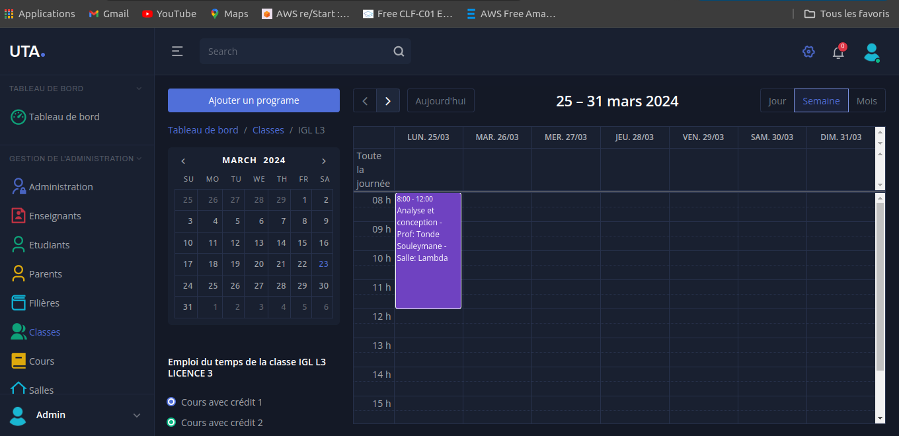
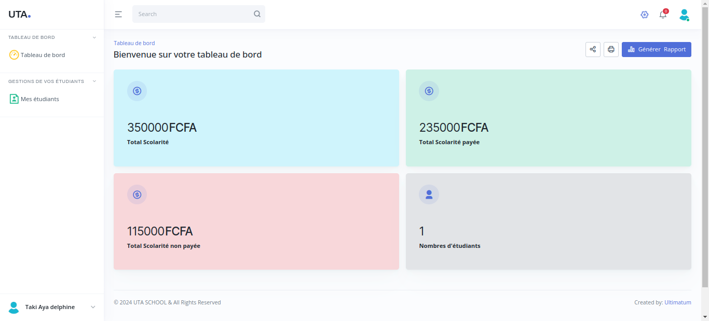
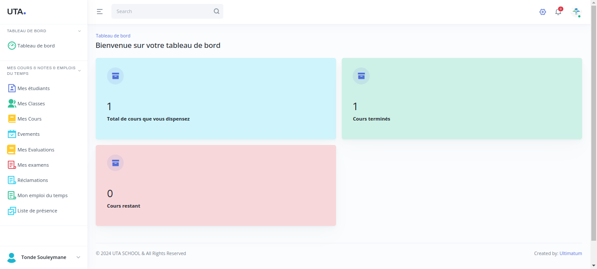
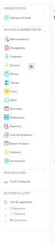
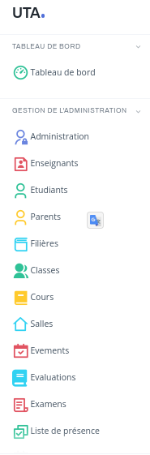
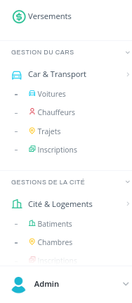

# SCHOOL MANAGER (school management system )

## Table of Contents

- [Stack](#stack)
- [Description](#description)
- [Features](#features)
- [Installation](#installation)
- [Run](#run)
- [Screenshots](#screenshots)

## Stack

- Laravel 11
- Laravel Livewire
- Laravel notification
- Laravel mail
- Laravel blade

## Description

This is a school management system that allows the management of the school's actors such as the administration, teachers, students, parent city, car transport, multi-dashboard for each actor, notification, and messaging.

## Features

- Administration (Depend on Role)
- Teacher
- Student
- Parent
- City
- Car Transport
- Notification
- Messaging
- Double Authentication

## Installation

```bash
   git clone
   cd school-manager
   composer install
   npm install
   cp .env.example .env
   php artisan key:generate
   php artisan migrate
   php artisan db:seed
```

## Run

```bash
    npm run dev
   php artisan serve
```

## Screenshots











